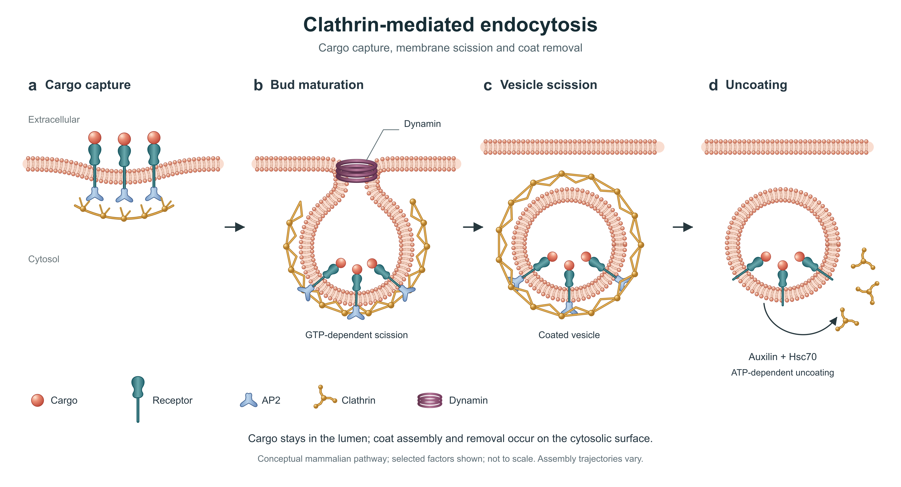

# Biology live evaluation: clathrin-mediated endocytosis

Original conceptual mammalian-cell illustration. Evaluated on 8 September 2026 by the executing Codex agent; no independent biological peer review or journal endorsement is claimed.

## Saved deliverables

- [Final PNG](endocytosis.png): exported directly from the editable SVG, 3840 × 2080 pixels.
- [Editable SVG](endocytosis.svg): live text and 68 selectable semantic objects; no embedded bitmap or external resources.
- [Inspected image2 master](image2-master.png): the corrected native-generation visual reference.
- [Initial image2 draft](image2-master-v1.png): retained as an explicitly unsuccessful first draft, not the final figure.
- [Scientific sources](sources.md), [brief](brief.md), [caption](caption.md), [visual/scientific review](visual-comparison.md) and [editor test record](edit-test.md).

## What actually ran

1. Read relevant primary evidence and inspect two published figures. Source images were used for research only and are not redistributed or supplied as generation inputs.
2. Call native image generation twice: an initial generation, then a targeted correction. The tool does not expose a model selector or report its exact backend; no pinned/highest-model claim is made.
3. Catch defects in the first image: a misspelled compartment label, ambiguous leaders, an uncoating arrow that implied the reverse operation, a missing requested scission annotation and missing surface membrane in the last panel.
4. Inspect the corrected master and reconstruct original vector geometry with gradients, editable membrane/protein/coat objects and live annotations. Correct reconstruction defects involving the coat opening and crowding of cargo symbols.
5. Render the SVG as PNG. Import the SVG in the bundled editor, change a live label, recolour a single component, move an arrow, save to disk, reopen that saved SVG and verify the retained changes. Export a PNG from the reopened file.

## Reopen and edit on your computer

Download this repository (or this example's SVG and the editor). Open [the standalone editor](../../assets/svg-editor.html) from disk in a normal desktop browser, choose **Open SVG**, and select `endocytosis.svg`. Use the object selector or click an object; edit text/colour/position and choose **Save SVG**. The saved SVG can be reopened later. Downloaded HTML files should be opened as files; GitHub's source-code view is not the editor itself.

For advanced path editing, use a vector application and retain the SVG master. The bundled editor needs no image-generation call, account or external assets for these operations. Its tested interaction ran on localhost in the Codex browser; direct `file://` opening was blocked by that browser's automation policy and is not claimed as tested. Illustrator, Inkscape and PowerPoint application compatibility was not tested.

## Scope of the science and visual evaluation

The example tests membrane topology, sidedness of receptor/coat components, nucleotide dependence labels, ordered stages and figure readability. It uses conceptual protein glyphs and a simplified two-dimensional coat lattice, not atomic coordinates, measured stoichiometry, a specific cargo/receptor identity or a universal assembly trajectory. The vector reconstruction preserves the functional layout, palette, gradients and visual hierarchy; it is not a pixel-identical conversion of the raster master.

This single case supports a **case-level** demonstration for cell biology, not a success-rate estimate or validation of every biological subfield. Other disciplines in the support matrix have written guidance but no new live generation benchmark in this release.

## Reproduce the vector output

`python build_figure.py` rebuilds the source with the Python standard library. `node render_figure.cjs` exports PNG using the `sharp` Node package; install that package in your own project or set `FIGURE_NODE_MODULES` to an existing appropriate dependency directory. Image2 calls are not automatically repeated by these scripts. Their exact prompts are saved in `prompt-v1.txt` and `prompt-v2.txt`.

The [review record](review.json) binds evidence to file hashes. It records the executing agent's checks; the checker is not an independent scientific or aesthetic certification.
