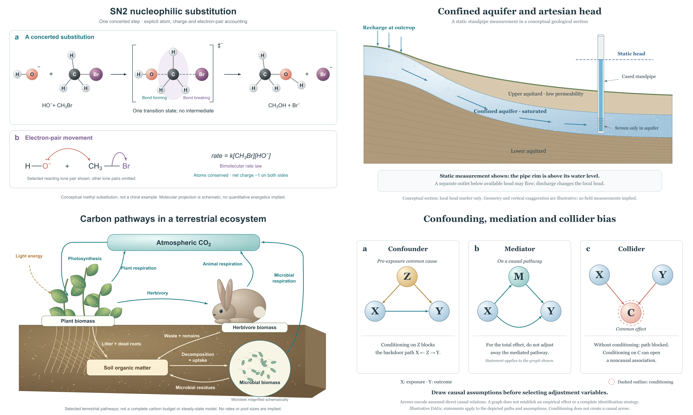

# Cross-discipline live evaluation



Four actual native image2-to-SVG cases, completed on 8 September 2026. Each final PNG is 4000 × 2400 pixels and is exported from its corresponding fully vector SVG. This is case-level evidence, not a benchmark of all scientific disciplines.

| Case | PNG | Editable SVG | Selectable objects | Scientific emphasis |
| --- | --- | --- | --- | --- |
| Organic chemistry: SN2 | [PNG](chemistry-sn2/figure.png) | [SVG](chemistry-sn2/figure.svg) | 95 | Atoms, charge, partial bonds, electron-pair arrows |
| Groundwater: confined aquifer | [PNG](earth-confined-aquifer/figure.png) | [SVG](earth-confined-aquifer/figure.svg) | 30 | Outcrop, static head and actual screen position |
| Ecology: terrestrial carbon | [PNG](ecology-carbon/figure.png) | [SVG](ecology-carbon/figure.svg) | 51 | Nine directed carbon transfers; light is energy |
| Research methods: causal DAGs | [PNG](research-causal-dags/figure.png) | [SVG](research-causal-dags/figure.svg) | 57 | Exact edges, acyclicity and path-specific conditioning |

All four underwent actual editor import, live-label modification, component recolouring, arrow movement, SVG download, editor reload, saved-file reimport, verification and PNG export. The test copies and records are inside each case folder. Reviews were performed by the executing agent; there was no independent expert panel or journal assessment.

## What failed and changed

There were **seven actual native calls** for these four cases: four initial generations and three targeted edits. Chemistry required two edits of its initially two-headed electron arrow. The groundwater draft required a correction to water/head, exposed recharge geometry and an inconsistent flowing-well inset. Final SVG reconstruction also corrected arrow origins and label collisions. The ecology and causal masters needed no additional image-generation call, but were still reconstructed and inspected.

Earlier `image2-master-v*` files are retained as **failed drafts**, not deliverables. See each `visual-comparison.md`. No first-pass reliability percentage is inferred from this small, selected set. Fine organic/raster textures are simplified in the full-vector versions, particularly ecology; no lossless conversion claim is made.

## Open and edit later / 日后编辑

1. Keep this folder on your computer. Use each `figure.svg` as the editable original; `figure.png` is the corresponding image.
2. Open the bundled `svg-editor.html` in a browser and choose the local SVG. If local HTML is restricted, run `python -m http.server 8771 --bind 127.0.0.1` in this folder and open `http://127.0.0.1:8771/svg-editor.html`.
3. Select a named object; edit a label, recolour a component or move an arrow. Save SVG to download a new file. Reopen that saved file to continue editing without calling image2.
4. Export PNG from the current state. The browser normally saves downloads to its configured Downloads folder; retain them with your project.

本次已实测本地 SVG 的修改、保存、重新打开和 PNG 导出。后续基本编辑不依赖云端上传。直接双击 HTML、Inkscape、Illustrator 及 PowerPoint 的实际兼容性未测试。复杂路径和上下标适合专业矢量编辑器或修改生成脚本；小编辑器替换整段文字会重置该段内部的上下标。修改科研内容后需重新核对科学关系。

## Reproduce the vectors and checks

The original shared `build_cases.py` and `vector.py` use Python 3.10+ standard library only. `validate_cases.py` checks selected properties of the actual SVG; `test_cases.py` contains mutation tests. It is not a universal chemical, hydrological, ecosystem or causal verifier.

```sh
python build_cases.py
python validate_cases.py
python -m unittest test_cases -v
node render_cases.cjs
```

The last command requires Node.js and Sharp available as `require('sharp')` or through `FIGURE_NODE_MODULES`. It exports PNGs from SVG without another model call. Rebuilding changes evidence hashes if source or renderer output changes: inspect the result and update reviews only after a real review, not by automatically marking gates as passed. Source research images/PDFs are not distributed.
