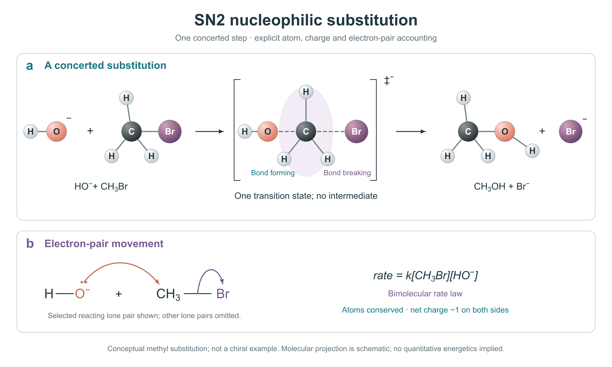

# SN2 nucleophilic substitution

[PNG](figure.png) · [Editable SVG](figure.svg) · [Image2 master](image2-master.png) · [Caption](caption.md) · [Sources](sources.md)

95 semantic editable objects, live text and vector geometry. No embedded raster or external SVG resources. Shared generator, renderer and editing instructions are in the [bundle guide](../README.md).

[Scientific checks](scientific-check.json) · [Visual differences and corrected defects](visual-comparison.md) · [Actual editor test](edit-test.md) · [Review evidence](review.json)

This case was researched, generated, reconstructed and self-reviewed. It is not an independent validation of the whole discipline. Older `image2-master-v*` files, where present, are failed research drafts retained only as evaluation evidence; use the canonical PNG/SVG pair.
