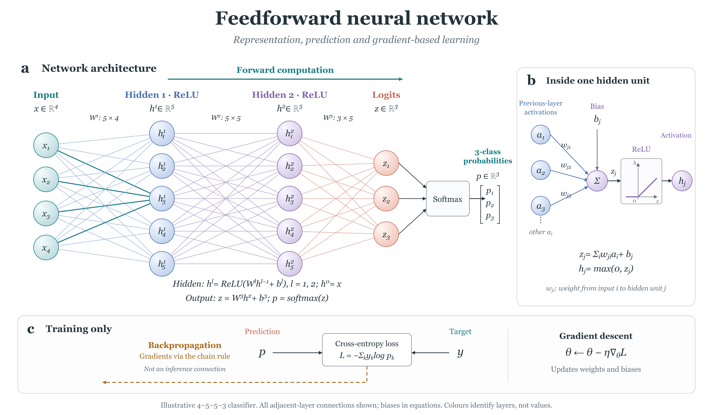

# Feedforward neural network

[PNG](neural-network.png) · [Editable SVG](neural-network.svg) · [Native master](image2-master.png) · [Caption](caption.md) · [Sources](sources.md) · [Editing instructions](如何编辑.md)

An illustrative fully connected 4–5–5–3 classifier: 17 main nodes and all 60 adjacent-layer connections, ReLU hidden units, one shared softmax and a separate training strip. The final SVG has 188 semantic editable objects, with live mathematical text; its PNG is 4800 × 2800.

One actual native generation was followed by original vector reconstruction, graph/dimension checks, visual inspection and an actual local editor save/reopen/export test. The [review record](review.json), [test evidence](edit-test.md) and [visual comparison](visual-comparison.md) document the scope. The editor's gradient recolouring was corrected to preserve opaque shading rather than exposing underlying lines.

This is an artificial network illustration, not a trained model or a biological neural circuit. It does not validate other architectures or prediction performance. The exact native model backend was undisclosed. Scientific/visual reviews were executing-agent self-reviews; no independent expert or journal certification is claimed.
