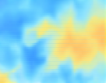
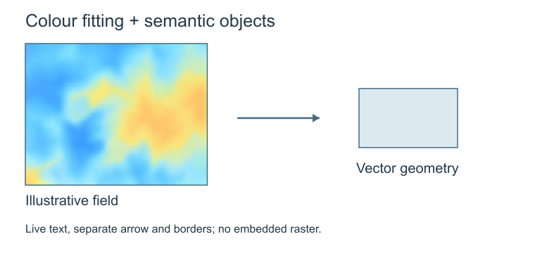

# Editable colour-region example

This small example demonstrates the [regional reconstruction method](../../references/png-to-svg.md). It is not a weather prediction, measured map or validated scientific mechanism. The source is an isolated illustrative colour field from an image generated during the image2 workflow; no raw user input or third-party paper image is bundled.

| PNG colour region | Fitted SVG, rendered at the same size |
| --- | --- |
|  |  |

The [source PNG](source.png) is 136 × 106 pixels. The [SVG region](region.svg) uses a 55 × 43 sampling grid, editable gradient stops, masks and clipped rectangles, with no embedded raster. This denser grid was selected after comparison with the helper's 27 × 21 default. Small-scale detail is still smoothed; this is not lossless recovery. [Provenance](provenance.json) records the generated master hash and crop coordinates without personal paths. Native generation did not report its backend version.

The integration example adds separately editable live labels, a boundary, an arrow and a simple component. It illustrates file structure, not a scientific process:

Download [example.svg](example.svg) to a persistent folder and open it in the [bundled editor](../../assets/svg-editor.html) or an SVG editor. Labels are normal text; the arrow and component are named groups. The colour field can move as a group and its gradient stops can be edited in a capable editor or in source. The bundled editor does not expose individual gradient stops. Its colour button applies a tint and will not preserve an arbitrary multicolour field; use it on the simple component for the basic edit test.

## Reproduce

Run from the repository root, using Python 3.10+ with Pillow installed:

~~~sh
python examples/vector-reconstruction/build_demo.py --output outputs/region-demo
python scripts/audit_svg.py outputs/region-demo/region.svg --full-vector
python scripts/audit_svg.py outputs/region-demo/example.svg --full-vector --live-text
~~~

The script refuses to replace existing output SVGs. Use a new output directory for another run. The standalone region has no labels by design, so its audit does not request live text. The integration example does.

Run `python examples/vector-reconstruction/verify_demo.py --output outputs/region-edit-test` to check the published pair and create a source-level edit/save/reparse test copy. This verifies file edits without claiming an application UI test. It also prints supplementary RGB error for the matched colour region, which is not a scientific or whole-figure quality score.

To reproduce the PNG previews, use [render_previews.cjs](render_previews.cjs) with Node.js and Sharp installed. Pass the output directory as its first argument. It creates separate preview files and refuses to overwrite them. The optional `FIGURE_NODE_MODULES` environment variable can point to an existing dependency directory.

For the edited copy, run `node examples/vector-reconstruction/render_previews.cjs outputs/region-edit-test edit-test`, then inspect its PNG. See [the comparison record](comparison.json) for observed grid-size trade-offs and output hashes. Rendered RGB error supports the regional comparison; it does not replace visual review.

## Validation scope

The generic helper is covered by deterministic tests, including correct sample/crop handling, vector-only structure, opaque seams, provenance and overwrite protection. The two published SVGs were rendered through Sharp, decoded and visually inspected. A source-level edit/save/reparse check verified one live label, one component colour and the independent arrow position. This component example has not received a new application UI round trip; the full local comparison's actual browser test is separately described in the method guide. Other desktop editors and direct file-URL loading remain untested.

Image similarity does not establish science or recover semantic objects. This example is a reproducible component fixture, not an additional discipline benchmark or a full figure-release record.
